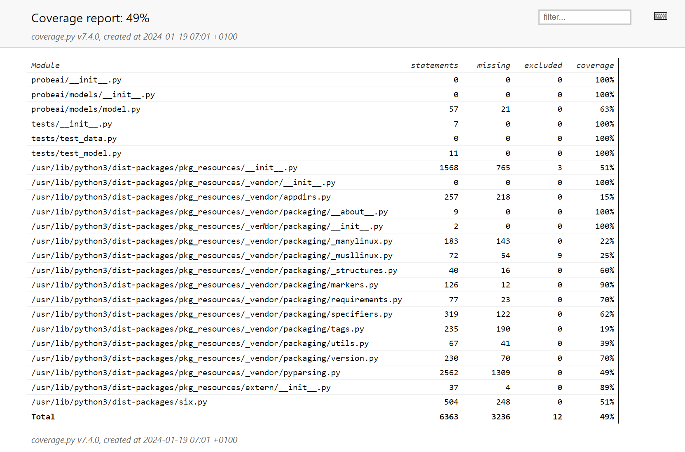

# Exam template for 02476 Machine Learning Operations

This is the report template for the exam. Please only remove the text formatted as with three dashes in front and behind
like:

```--- question 1 fill here ---```

where you instead should add your answers. Any other changes may have unwanted consequences when your report is auto
generated in the end of the course. For questions where you are asked to include images, start by adding the image to
the `figures` subfolder (please only use `.png`, `.jpg` or `.jpeg`) and then add the following code in your answer:

```markdown

```

In addition to this markdown file, we also provide the `report.py` script that provides two utility functions:

Running:

```bash
python report.py html
```

will generate an `.html` page of your report. After deadline for answering this template, we will autoscrape
everything in this `reports` folder and then use this utility to generate an `.html` page that will be your serve
as your final handin.

Running

```bash
python report.py check
```

will check your answers in this template against the constrains listed for each question e.g. is your answer too
short, too long, have you included an image when asked to.

For both functions to work it is important that you do not rename anything. The script have two dependencies that can
be installed with `pip install click markdown`.

## Overall project checklist

The checklist is *exhaustic* which means that it includes everything that you could possible do on the project in
relation the curricilum in this course. Therefore, we do not expect at all that you have checked of all boxes at the
end of the project.

### Week 1

* [*] Create a git repository
* [*] Make sure that all team members have write access to the github repository
* [*] Create a dedicated environment for you project to keep track of your packages
* [*] Create the initial file structure using cookiecutter
* [*] Fill out the `make_dataset.py` file such that it downloads whatever data you need and
* [*] Add a model file and a training script and get that running
* [*] Remember to fill out the `requirements.txt` file with whatever dependencies that you are using
* [*] Remember to comply with good coding practices (`pep8`) while doing the project
* [ ] Do a bit of code typing and remember to document essential parts of your code
* [*] Setup version control for your data or part of your data
* [*] Construct one or multiple docker files for your code
* [*] Build the docker files locally and make sure they work as intended
* [*] Write one or multiple configurations files for your experiments
* [*] Used Hydra to load the configurations and manage your hyperparameters
* [*] When you have something that works somewhat, remember at some point to to some profiling and see if
      you can optimize your code
* [*] Use Weights & Biases to log training progress and other important metrics/artifacts in your code. Additionally,
      consider running a hyperparameter optimization sweep.
* [*] Use Pytorch-lightning (if applicable) to reduce the amount of boilerplate in your code

### Week 2

* [*] Write unit tests related to the data part of your code
* [*] Write unit tests related to model construction and or model training
* [*] Calculate the coverage.
* [*] Get some continuous integration running on the github repository
* [*] Create a data storage in GCP Bucket for you data and preferable link this with your data version control setup
* [*] Create a trigger workflow for automatically building your docker images
* [ ] Get your model training in GCP using either the Engine or Vertex AI
* [ ] Create a FastAPI application that can do inference using your model
* [ ] If applicable, consider deploying the model locally using torchserve
* [ ] Deploy your model in GCP using either Functions or Run as the backend

### Week 3

* [ ] Check how robust your model is towards data drifting
* [ ] Setup monitoring for the system telemetry of your deployed model
* [ ] Setup monitoring for the performance of your deployed model
* [ ] If applicable, play around with distributed data loading
* [ ] If applicable, play around with distributed model training
* [ ] Play around with quantization, compilation and pruning for you trained models to increase inference speed

### Additional

* [*] Revisit your initial project description. Did the project turn out as you wanted?
* [*] Make sure all group members have a understanding about all parts of the project
* [*] Uploaded all your code to github

## Group information

### Question 1
> **Enter the group number you signed up on <learn.inside.dtu.dk>**
>
> Answer:

Group 92

### Question 2
> **Enter the study number for each member in the group**
>
> Example:
>
> *sXXXXXX, sXXXXXX, sXXXXXX*
>
> Answer:

s220356

### Question 3
> **What framework did you choose to work with and did it help you complete the project?**
>
> Answer length: 100-200 words.
>
> Example:
> *We used the third-party framework ... in our project. We used functionality ... and functionality ... from the*
> *package to do ... and ... in our project*.
>
> Answer:

Packages used:
* PyTorch Lightning:
      * PyTorch Lightning is a lightweight wrapper for PyTorch that simplifies the training process. It also provides a number of useful features, including automatic checkpointing, logging, and early stopping.
* Hydra:
      * Hydra's configuration system is particularly useful for managing hyperparameters and experiment configurations, which is why I used it in this project.
* Weights & Biases:
      * Allows us to log and visualize metrics, hyperparameters, and artifacts. It also provides a number of useful features, including hyperparameter sweeps, model versioning, and experiment comparison.
* DVC:
      * DVC is a version control system for data science projects. It allows data versioning, data pipelines, and data sharing. These features helped me streamline the data management process.
* Docker:
      * Docker is a containerization platform. It allows us to package our code and its dependencies into a container, making it portable and reproducible.
* CML:
      * CML is a CI/CD tool for machine learning projects. It allows us to automate the testing and deployment of our models. Here it is used for a workflow trigger, and reports.


## Coding environment

> In the following section we are interested in learning more about you local development environment.

### Question 4

> **Explain how you managed dependencies in your project? Explain the process a new team member would have to go**
> **through to get an exact copy of your environment.**
>
> Answer length: 100-200 words
>
> Example:
> *We used ... for managing our dependencies. The list of dependencies was auto-generated using ... . To get a*
> *complete copy of our development environment, one would have to run the following commands*
>
> Answer:

I utilized `conda` for managing dependencies in the project. The list of dependencies, including Python packages and their versions, was auto-generated and stored in the `requirements.txt` file. To replicate our development environment, a new team member would need to create a conda environment using:
```bash
conda env create --name <env_name>
```

Then, they would need to activate the environment using:
```bash
conda activate <env_name>
```
where `<env_name>` is the name of the environment.

To install the packages, run:
```bash
pip install -r requirements.txt
```

### Question 5

> **We expect that you initialized your project using the cookiecutter template. Explain the overall structure of your**
> **code. Did you fill out every folder or only a subset?**
>
> Answer length: 100-200 words
>
> Example:
> *From the cookiecutter template we have filled out the ... , ... and ... folder. We have removed the ... folder*
> *because we did not use any ... in our project. We have added an ... folder that contains ... for running our*
> *experiments.*
> Answer:

## Project structure

The directory structure of the project looks like this:

```txt

├── Makefile             <- Unused
├── README.md            <- The top-level README for developers using this project.
├── data (*not included*)
│   ├── processed  <- output of the data pipeline.
│   ├── raw        <- The current version of the data.
│   └── source     <- The original, immutable data dump.
|
├── docs                 <- Unused
│   │
│   ├── index.md         <- Homepage for your documentation
│   │
│   ├── mkdocs.yml       <- Configuration file for mkdocs
│   │
│   └── source/          <- Source directory for documentation files
│
├── models               <- Used for locally storing models and performance metrics,
│                          as well as for storing models in the cloud.
│
├── notebooks            <- Jupyter notebooks.
│
├── pyproject.toml       <- Project configuration file
│
├── reports              <- Generated analysis as HTML, PDF, LaTeX, etc.
│   └── figures          <- Generated graphics and figures to be used in reporting
│
├── requirements.txt     <- The requirements file for reproducing the analysis environment
|
├── requirements_dev.txt <- The requirements file for reproducing the analysis environment
│
├── tests                <- Test files
│
├── probeai  <- Source code for use in this project.
│   │
│   ├── __init__.py      <- Makes folder a Python module
│   │
│   ├── data             <- Scripts to generate data
│   │   ├── __init__.py
│   │   └── make_dataset.py
│   │
│   ├── models           <- model implementations
│   │   ├── __init__.py
│   │   ├── model.py
│   │
│   ├── visualization    <- depreciated with v1.0.0
│   │   ├── __init__.py
│   │   └── visualize.py
│   ├── train.py         <- script for training the model
│   └── predict_model.py <- script for predicting from a model
│
└── LICENSE              <- Open-source license if one is chosen
```

Created using [mlops_template](https://github.com/SkafteNicki/mlops_template),
a [cookiecutter template](https://github.com/cookiecutter/cookiecutter) for getting
started with Machine Learning Operations (MLOps).

### Question 6

> **Did you implement any rules for code quality and format? Additionally, explain with your own words why these**
> **concepts matters in larger projects.**
>
> Answer length: 50-100 words.
>
> Answer:

I enforced code quality and format rules using `ruff`. These rules ensure consistent coding practices, making the codebase more readable and maintainable. In larger projects, these concepts reduce debugging time, enhance overall project efficiency and readability. As such, people who are less familiar with the codebase can focus on understanding the code, rather than the formatting.

## Version control

> In the following section we are interested in how version control was used in your project during development to
> corporate and increase the quality of your code.

### Question 7

> **How many tests did you implement and what are they testing in your code?**
>
> Answer length: 50-100 words.
>
> Example:
> *In total we have implemented X tests. Primarily we are testing ... and ... as these the most critical parts of our*
> *application but also ... .*
>
> Answer:

Initially I ran 2 tests, one for checking the data and another for checking the model. However, with my difficulties with dvc, I ended up only keeping the latter. The test is meant to assert the model's output shape.

### Question 8

> **What is the total code coverage (in percentage) of your code? If you code had an code coverage of 100% (or close**
> **to), would you still trust it to be error free? Explain you reasoning.**
>
> Answer length: 100-200 words.
>
> Example:
> *The total code coverage of code is X%, which includes all our source code. We are far from 100% coverage of our **
> *code and even if we were then...*
>
> Answer:



Even with 100% code coverage, there may be scenarios or edge cases that tests dont't captured. Code coverage measures tested code, not correctness or all possible scenarios. Logical errors, changing environments, and unforeseen use cases can still lead to bugs despite thorough testing.

### Question 9

> **Did you workflow include using branches and pull requests? If yes, explain how. If not, explain how branches and**
> **pull request can help improve version control.**
>
> Answer length: 100-200 words.
>
> Example:
> *We made use of both branches and PRs in our project. In our group, each member had an branch that they worked on in*
> *addition to the main branch. To merge code we ...*
>
> Answer:

Yes, I did use branches. For the development of the project, I created a `dev` branch. This allowed me to work on features without affecting the main branch. Once I was done with a feature, I created a pull request to merge the branch with the main branch. This workflow helped me keep the main branch clean and stable, while allowing me to work on the various features.

In general branches are useful for parallel development, allowing multiple people to work on different parts of the code simultanously. Pull requests are useful for reviewing code and ensuring that the main branch is as stable as possible. Also, with github actions, I find them even more interesting and important!

### Question 10

> **Did you use DVC for managing data in your project? If yes, then how did it improve your project to have version**
> **control of your data. If no, explain a case where it would be beneficial to have version control of your data.**
>
> Answer length: 100-200 words.
>
> Example:
> *We did make use of DVC in the following way: ... . In the end it helped us in ... for controlling ... part of our*
> *pipeline*
>
> Answer:

I adopted DVC (Data Version Control) to manage data efficiently in the project, but truth to be told, for the small amount of data I am working with it was more or a pain than a gain. It especially gets complicated with the different tokens and authentications required to access the data. However, I can, without a doubt see the benefits of using DVC for larger projects with more data. It allows us to version data, track changes, and share data across teams. It also allows us to reproduce experiments and pipelines, which is crucial for the long-term sustainability of the project.

### Question 11

> **Discuss you continues integration setup. What kind of CI are you running (unittesting, linting, etc.)? Do you test**
> **multiple operating systems, python version etc. Do you make use of caching? Feel free to insert a link to one of**
> **your github actions workflow.**
>
> Answer length: 200-300 words.
>
> Example:
> *We have organized our CI into 3 separate files: one for doing ..., one for running ... testing and one for running*
> *... . In particular for our ..., we used ... .An example of a triggered workflow can be seen here: <weblink>*
>
> Answer:

I have gotten to the point in which I am building a docker container at every master branch push. I ha also worked on getting the CLM done, but I ran into issues with authenticating to the dvc host. Nevertheless, I have added the pytest tests as well.

## Running code and tracking experiments

> In the following section we are interested in learning more about the experimental setup for running your code and
> especially the reproducibility of your experiments.

### Question 12

> **How did you configure experiments? Did you make use of config files? Explain with coding examples of how you would**
> **run a experiment.**
>
> Answer length: 50-100 words.
>
> Example:
> *We used a simple argparser, that worked in the following way: python my_script.py --lr 1e-3 --batch_size 25*
>
> Answer:

Originally I had the argparser solution, but I switched to Hydra. I used Hydra to manage hyperparameters and experiment configurations. I created a config file for each experiment, which allowed me to easily run multiple experiments with different configurations. For example, to run an experiment, I would run:
```bash
python train.py experiment=experiment_name
```
where `experiment_name` is the name of the experiment.

It is important to note that an experiment is a combination of 2 config files: `model_conf` and `train_conf`.

```yaml
`train_conf`
dataset_path: ~/probeai/data/raw
batch_size: 4
learning_rate: 0.01
n_epochs: 5
seed: 42
```

```yaml
in_features: 1
out_features: 2
```

### Question 13

> **Reproducibility of experiments are important. Related to the last question, how did you secure that no information**
> **is lost when running experiments and that your experiments are reproducible?**
>
> Answer length: 100-200 words.
>
> Example:
> *We made use of config files. Whenever an experiment is run the following happens: ... . To reproduce an experiment*
> *one would have to do ...*
>
> Answer:

--- question 13 fill here ---

### Question 14

> **Upload 1 to 3 screenshots that show the experiments that you have done in W&B (or another experiment tracking**
> **service of your choice). This may include loss graphs, logged images, hyperparameter sweeps etc. You can take**
> **inspiration from [this figure](figures/wandb.png). Explain what metrics you are tracking and why they are**
> **important.**
>
> Answer length: 200-300 words + 1 to 3 screenshots.
>
> Example:
> *As seen in the first image when have tracked ... and ... which both inform us about ... in our experiments.*
> *As seen in the second image we are also tracking ... and ...*
>
> Answer:

--- question 14 fill here ---

### Question 15

> **Docker is an important tool for creating containerized applications. Explain how you used docker in your**
> **experiments? Include how you would run your docker images and include a link to one of your docker files.**
>
> Answer length: 100-200 words.
>
> Example:
> *For our project we developed several images: one for training, inference and deployment. For example to run the*
> *training docker image: `docker run trainer:latest lr=1e-3 batch_size=64`. Link to docker file: <weblink>*
>
> Answer:

--- question 15 fill here ---

### Question 16

> **When running into bugs while trying to run your experiments, how did you perform debugging? Additionally, did you**
> **try to profile your code or do you think it is already perfect?**
>
> Answer length: 100-200 words.
>
> Example:
> *Debugging method was dependent on group member. Some just used ... and others used ... . We did a single profiling*
> *run of our main code at some point that showed ...*
>
> Answer:

In general I am big fan of Python's error messages. They are very informative and help me debug my code. I also used `pdb` to debug my code, but mainly for the exercise. I used `cProfile` to profile my code. In addition, I used the tensorboard profiler as well. These tools helped me identify bottlenecks in my code and optimize it accordingly.

## Working in the cloud

> In the following section we would like to know more about your experience when developing in the cloud.

### Question 17

> **List all the GCP services that you made use of in your project and shortly explain what each service does?**
>
> Answer length: 50-200 words.
>
> Example:
> *We used the following two services: Engine and Bucket. Engine is used for... and Bucket is used for...*
>
> Answer:

I used the following GCP services in my project:
- **Compute Engine**: I used Compute Engine to train my models in the cloud. I used a custom container to train my models.
- **Cloud Storage**: I used Cloud Storage to store my data and trained models. I used a bucket to store my data and a container registry to store my trained models.
- **Cloud Build**: I used Cloud Build to build my custom container. I used a trigger to automatically build the container whenever I pushed code to my repository.

### Question 18

> **The backbone of GCP is the Compute engine. Explained how you made use of this service and what type of VMs**
> **you used?**
>
> Answer length: 100-200 words.
>
> Example:
> *We used the compute engine to run our ... . We used instances with the following hardware: ... and we started the*
> *using a custom container: ...*
>
> Answer:

--- question 18 fill here ---

### Question 19

> **Insert 1-2 images of your GCP bucket, such that we can see what data you have stored in it.**
> **You can take inspiration from [this figure](figures/bucket.png).**
>
> Answer:

--- question 19 fill here ---

### Question 20

> **Upload one image of your GCP container registry, such that we can see the different images that you have stored.**
> **You can take inspiration from [this figure](figures/registry.png).**
>
> Answer:

--- question 20 fill here ---

### Question 21

> **Upload one image of your GCP cloud build history, so we can see the history of the images that have been build in**
> **your project. You can take inspiration from [this figure](figures/build.png).**
>
> Answer:

--- question 21 fill here ---

### Question 22

> **Did you manage to deploy your model, either in locally or cloud? If not, describe why. If yes, describe how and**
> **preferably how you invoke your deployed service?**
>
> Answer length: 100-200 words.
>
> Example:
> *For deployment we wrapped our model into application using ... . We first tried locally serving the model, which*
> *worked. Afterwards we deployed it in the cloud, using ... . To invoke the service an user would call*
> *`curl -X POST -F "file=@file.json"<weburl>`*
>
> Answer:

--- question 22 fill here ---

### Question 23

> **Did you manage to implement monitoring of your deployed model? If yes, explain how it works. If not, explain how**
> **monitoring would help the longevity of your application.**
>
> Answer length: 100-200 words.
>
> Example:
> *We did not manage to implement monitoring. We would like to have monitoring implemented such that over time we could*
> *measure ... and ... that would inform us about this ... behaviour of our application.*
>
> Answer:

--- question 23 fill here ---

### Question 24

> **How many credits did you end up using during the project and what service was most expensive?**
>
> Answer length: 25-100 words.
>
> Example:
> *Group member 1 used ..., Group member 2 used ..., in total ... credits was spend during development. The service*
> *costing the most was ... due to ...*
>
> Answer:

--- question 24 fill here ---

## Overall discussion of project

> In the following section we would like you to think about the general structure of your project.

### Question 25

> **Include a figure that describes the overall architecture of your system and what services that you make use of.**
> **You can take inspiration from [this figure](figures/overview.png). Additionally in your own words, explain the**
> **overall steps in figure.**
>
> Answer length: 200-400 words
>
> Example:
>
> *The starting point of the diagram is our local setup, where we integrated ... and ... and ... into our code.*
> *Whenever we commit code and puch to github, it auto triggers ... and ... . From there the diagram shows ...*
>
> Answer:

--- question 25 fill here ---

### Question 26

> **Discuss the overall struggles of the project. Where did you spend most time and what did you do to overcome these**
> **challenges?**
>
> Answer length: 200-400 words.
>
> Example:
> *The biggest challenges in the project was using ... tool to do ... . The reason for this was ...*
>
> Answer:

--- question 26 fill here ---

### Question 27

> **State the individual contributions of each team member. This is required information from DTU, because we need to**
> **make sure all members contributed actively to the project**
>
> Answer length: 50-200 words.
>
> Example:
> *Student sXXXXXX was in charge of developing of setting up the initial cookie cutter project and developing of the*
> *docker containers for training our applications.*
> *Student sXXXXXX was in charge of training our models in the cloud and deploying them afterwards.*
> *All members contributed to code by...*
>
> Answer:

Student s220356 is responsible for all the work done in this project.
